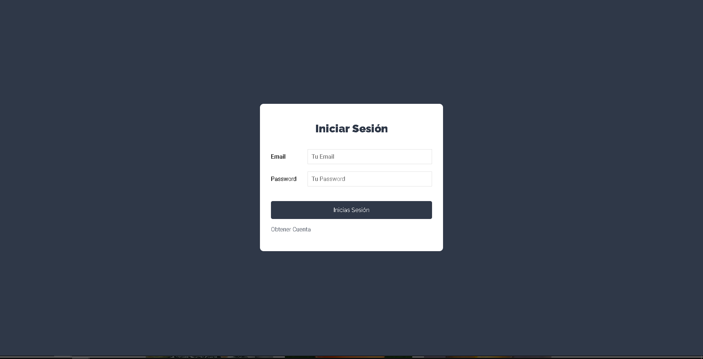
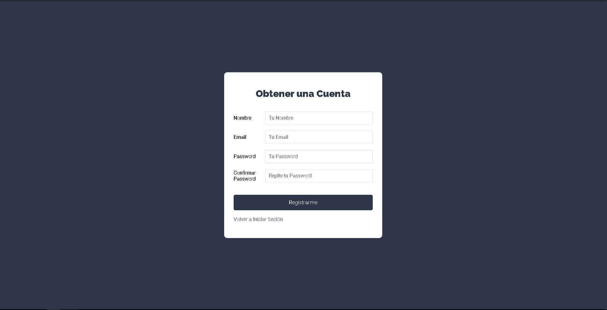
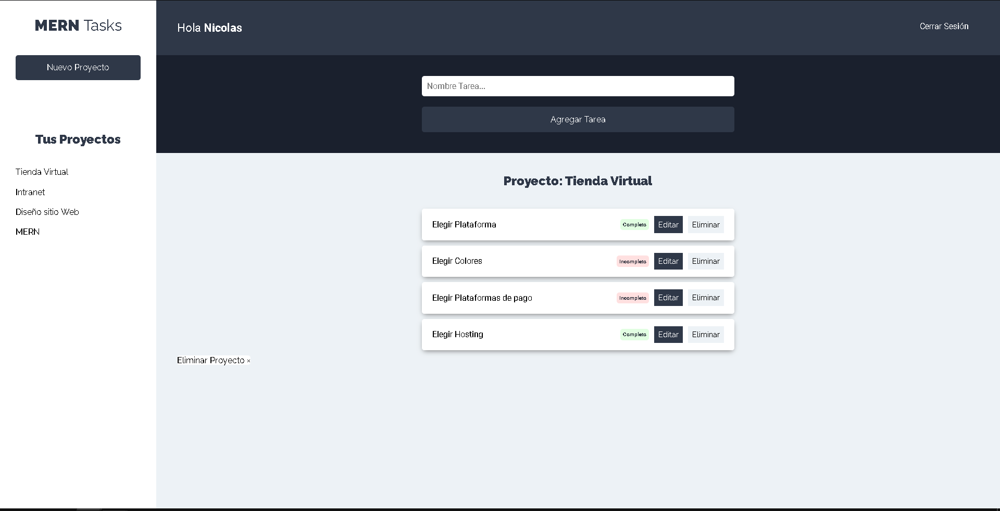

# RASKS

This is a project under development that uses the MERN stack. The main objective of the system is to be task manager, which allows having a unique user with different projects and each one of them with its own tasks. This project was made with learning purpose.

