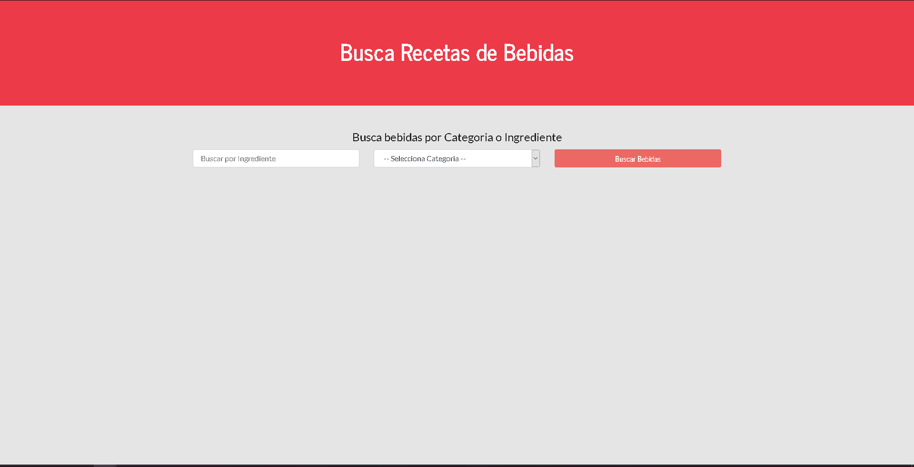
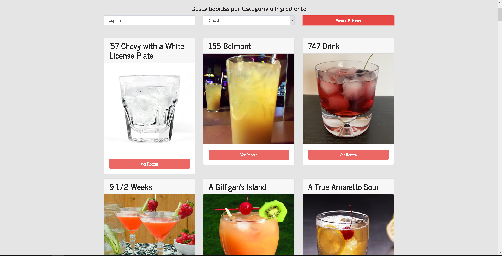
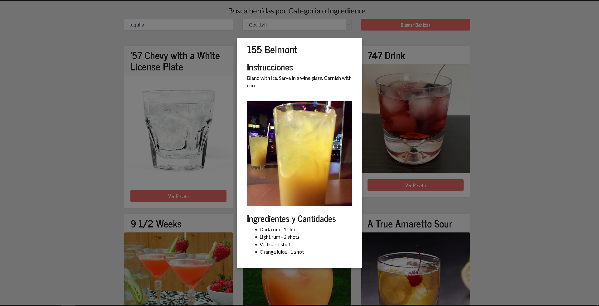

# DRINKS

This is a project that makes use of the external API [TheCocktailDB](https://www.thecocktaildb.com/) and lets the user search for the different options of cocktails and drinks that can make according to an ingredient. The project was made with learning purpose.

